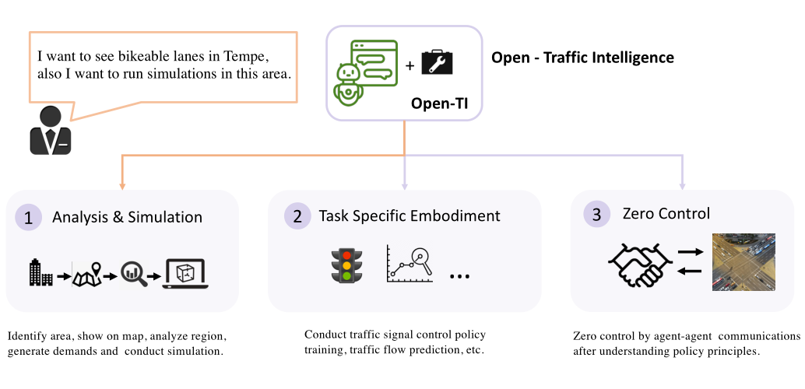
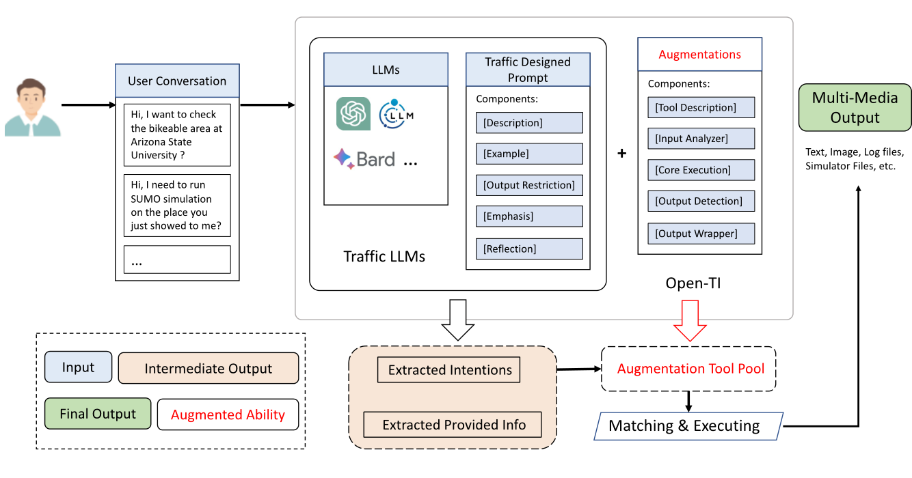
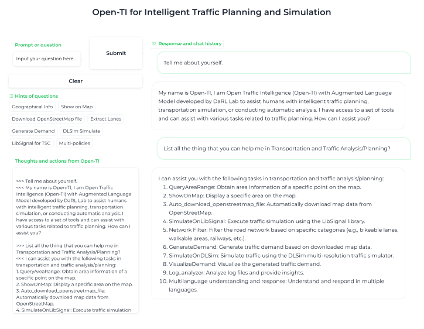

# Open-TI: Open Traffic Intelligence with Augmented Language Model


[](https://github.com/DaRL-LibSignal/OpenTI/tree/main)
[-red)](https://rdcu.be/dHu0b)
[](https://rubyliou1023.github.io/OpenTI_WEB/)
[](https://youtu.be/QOYWah7--nA)

## Introduction

Open-TI is a revolutionary traffic intelligence model that bridges the industry-academic gap in intelligent transportation. It leverages large language models to execute complex traffic analysis tasks, making it the first to seamlessly integrate external packages based on conversations. Beyond analysis, Open-TI can train traffic signal control policies, explore demand optimizations, and communicate with control agents like ChatZero for efficient task execution. With a formal structure and open-ended design, Open-TI invites community-driven enhancements, emphasizing its pivotal role in advancing intelligent transportation systems.


## O-D matrix Calibration
```
🚀 🚀 🚀
Just now! We released a dataset used for O-D Matrix Calibrations task. Please find in path: `OpenTI/llm_od/`
And we also included the preliminary exploration on using LLMs to achieve the O-D calibration task. The relevant technical report will come soon! Please stay tuned!

For details, please read: 
`OpenTI/llm_od/README.md`

```


## The overview of the Open-TI functionalities


## The design framework of Open-TI


## The Open-TI conversation interface



# Installation

## Source

Our code is based on Python version 3.9 and Pytorch version 1.11.0.
Open-TI provides installation from the source code. 
Please execute the following command to install and configure our environment.


```Powershell
clone https://github.com/DaRL-LibSignal/OpenTI.git
cd OpenTI
pip install -r requirements.txt
sudo apt-get install python3-tk
```

## Configuration

### LLM Configuration

First, you need to configure OpenAI-Key. Please create a `./config.yaml` file in the root directory and add the following content to the file (please modify the content to your own settings):

```yaml
OPENAI_API_TYPE: 'openai' #'azure'  OR 'openai'
# for 'openai'
OPENAI_KEY: '' # your openai key
Google_Map: '' # your googleAPI key
```

Here we recommend using at least ChatGPT-3.5-turbo to run as LLM. If you want to use your own LLM, please refer to [LangChain-Large Language Models](https://python.langchain.com/docs/modules/model_io/models/) to define Your own LLM. In this case, please modify the following sections in `./DataProcessBot.py` and `./SimulationProcessBot.py` to configure your own LLM.


## Simulator environment configuration
<br />
Though CityFlow, SUMO, and LibSignal are stable under Windows and Linux systems, we still recommend users work under the Linux system.<br><br>

### CityFlow Environment
<br />

To install CityFlow simulator, please follow the instructions on [CityFlow Doc](https://cityflow.readthedocs.io/en/latest/install.html#)


```
sudo apt update && sudo apt install -y build-essential cmake

git clone https://github.com/cityflow-project/CityFlow.git
cd CityFlow
pip install .
```
To test configuration:
```
python3
import cityflow
env = cityflow.Engine
```
<br>

### SUMO Environment
<br />

To install SUMO environment, please follow the instructions on [SUMO Doc](https://epics-sumo.sourceforge.io/sumo-install.html#)

```
sudo apt-get install cmake python3 g++ libxerces-c-dev libfox-1.6-dev libgdal-dev libproj-dev libgl2ps-dev swig

git clone --recursive https://github.com/eclipse/sumo

export SUMO_HOME="$PWD/sumo"
mkdir sumo/build/cmake-build && cd sumo/build/cmake-build
cmake ../..
make -j$(nproc)
```
If you cannot make the directory sumo/build/cmake-build, you could try the command below
```
cd sumo
mkdir build
cd build
mkdir cmake-build
cd cmake-build
```

To test installation:
```
cd ~/sumo/bin
./sumo
```

To add SUMO and traci model into the system PATH, execute the code below:
```
export SUMO_HOME=~/sumo
export PYTHONPATH="$SUMO_HOME/tools:$PYTHONPATH"
```
To test configuration:
```
python3
import libsumo
import traci
```
<br>

### LibSignal Environment
<br />

To install LibSignal environment, please follow the instructions

```
cd LibSignal
pip install -r requirements.txt
pip3 install torch torchvision torchaudio --extra-index-url https://download.pytorch.org/whl/cu113
pip install cmake
pip install lmdb

```

<br>

## Start Running
<br />

If you install all the requirments below, you can run Open-TI now.

```
cd OpenTI
cd pivotalAgent
python3 executor.py
```

<br>

## If you find this project helpful, please use below Citation

```

@article{da2024open,
	title = {Open-TI: Open Traffic Intelligence with Augmented Language Model},
	author = {Da, Longchao and Liou, Kuanru and Chen, Tiejin and Zhou, Xuesong and Luo, Xiangyong and Yang, Yezhou and Wei, Hua},
	date = {2024/10/01},
	doi = {10.1007/s13042-024-02190-8},
	id = {Da2024},
	isbn = {1868-808X},
	journal = {International Journal of Machine Learning and Cybernetics},
	number = {10},
	pages = {4761--4786},
	url = {https://doi.org/10.1007/s13042-024-02190-8},
	volume = {15},
	year = {2024}
}

```
